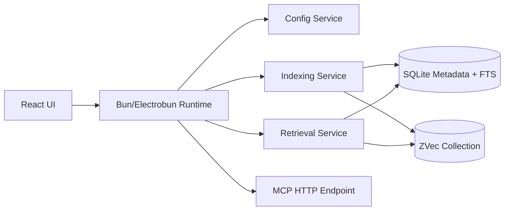
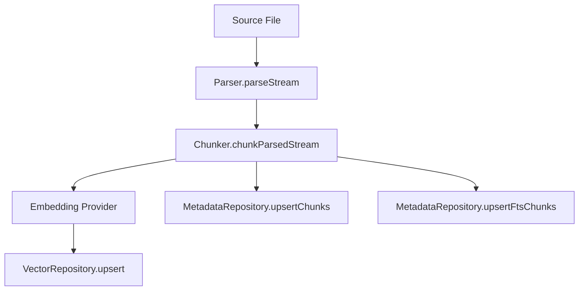
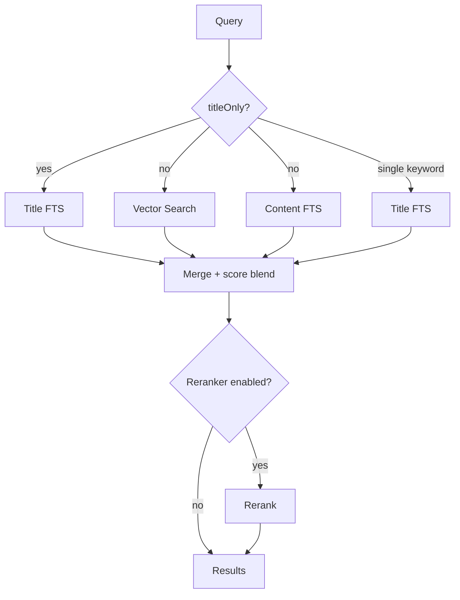

# Know Disk

[English](./README.md) | [中文](./README.zh-CN.md)

Know Disk is a local-first desktop RAG system designed around one practical idea:

**Use your file system as the source of truth, and treat indexing/vector data as rebuildable runtime state.**

It provides a complete loop for local knowledge retrieval:

1. Choose local source folders
2. Parse and chunk files
3. Embed and index chunks
4. Retrieve with hybrid scoring (vector + FTS)
5. Expose retrieval via UI and MCP

## Visual Overview



## 1. Design Goals

Know Disk is built for a local knowledge workflow where indexing must be reliable, inspectable, and recoverable.

Core goals:

- Local-first: data and indexing run on your machine
- Rebuildable cache model: vector/index state can be destroyed and regenerated
- Operational transparency: explicit health/status/logging for indexing and retrieval
- Practical extensibility: provider-based embedding/reranker and MCP endpoint

## 2. Core Concepts

### 2.1 Three Truths Model

Know Disk maintains three layers of truth:

1. **File System (truth)**
   Local files are always authoritative.
2. **SQLite Metadata (index state)**
   Tracks files, chunks, jobs, FTS rows, and source tombstones.
3. **Vector Collection (retrieval cache)**
   Stores embeddings + retrieval metadata for semantic search.

If metadata or vector state becomes stale/corrupt, it is expected to be rebuilt.

### 2.2 Source Lifecycle

Sources are configured folders (`config.sources`).

- Add/enable source: starts indexing path into metadata + vector
- Disable/remove source: marks deferred deletion (tombstone behavior)
- Startup cleanup + reconcile: applies deferred cleanup and catches drift

### 2.3 Indexing Pipeline

Per file, the indexing flow is:

1. Parse stream from parser
2. Chunk stream with configured chunking policy
3. Embed each chunk
4. Upsert vector rows
5. Upsert metadata chunk rows + FTS rows

Metadata records offsets and token estimates so chunks can be reconstructed from source files later.



### 2.4 Retrieval Model

Retrieval is hybrid and configurable by request mode.

- Normal mode:
  - vector search
  - content FTS search
  - plus title FTS when query is a single keyword
  - merged into one score space
- Title-only mode:
  - only title FTS contributes scoring

Results can be reranked if reranker is enabled.



### 2.5 Onboarding Model

On first use:

1. user must configure at least one source
2. embedding/reranker defaults can be reviewed
3. user enters Home once baseline config is valid

This forces a usable minimum state before normal operation.

### 2.6 Virtual File System (VFS)

Know Disk includes a mountable VFS layer under `packages/vfs` for multi-provider metadata browsing.

- Mount config:
  - `syncMetadata=true`: `walkChildren` pages from local SQLite metadata (`vfs_nodes`) using local cursor `(lastName,lastNodeId)`.
  - `syncMetadata=false`: `walkChildren` pages via provider cursor API, and backfills `vfs_nodes` + `vfs_page_cache` with TTL.
- Cursor semantics:
  - API cursor is always `VfsCursor = { mode, token }`.
  - `mode=local`: token encodes local sort boundary.
  - `mode=remote`: token encodes provider cursor.
- Boundary:
  - VFS owns mount/node tree/pagination/reconcile trigger only.
  - Content rendering/chunking (including markdown) is intentionally outside the VFS layer.

## 3. Runtime Architecture

- **UI (React)**
  Settings, onboarding, status, retrieval interaction
- **Bun runtime (Electrobun main)**
  DI container, config persistence, indexing orchestration, MCP endpoint
- **Core services**
  Config, indexing, retrieval, embedding, reranker, vector repo, metadata repo
- **Storage**
  - `bun:sqlite` for metadata + FTS
  - `@zvec/zvec` for vector collection

## 4. Configuration Strategy

Config is persisted and normalized on startup/update.

Key sections:

- `sources`: watched/indexed directories
- `indexing`: chunking, watch debounce, reconcile interval, retry policy
- `embedding`: provider-specific config (local / cloud)
- `reranker`: provider-specific config (local / cloud)
- `mcp`: enable flag + port

Design choice:

- Config is the operational contract
- Runtime data (`metadata`, `vector`) is disposable and reconstructable

## 5. Health and Observability

Know Disk exposes health and indexing status in UI.

Status includes:

- run phase/reason/errors
- scheduler queue depth
- worker current files / running workers / last error
- indexed file count from metadata

Logging uses structured pino logs with subsystem tags (`indexing`, `vector`, `retrieval`, etc.).

## 6. MCP Integration

When enabled, Know Disk exposes an HTTP MCP endpoint:

- `http://127.0.0.1:<port>/mcp`

This allows external MCP clients (e.g. ChatGPT/Claude/Desktop tools) to call local retrieval.

## 7. Data Paths

Default runtime root (macOS/Linux):

- `~/.knowdisk/app-config.json`
- `~/.knowdisk/metadata/index.db`
- `~/.knowdisk/zvec/...`
- `~/.knowdisk/cache/...`

## 8. Typical User Flow

1. Open app, complete onboarding
2. Add source folders in Settings
3. Wait for indexing/reconcile to settle
4. Run search from Home (normal or title-only)
5. Use force resync when you want full rebuild

## 9. Development

Monorepo note:

- This repo uses Bun workspace packages under `packages/*`.
- VFS core is extracted to `packages/vfs` and consumed by app/runtime via `@knowdisk/vfs`.

```bash
bun install
bun run dev
```

HMR mode:

```bash
bun run dev:hmr
```

Build:

```bash
bun run build
```

Test:

```bash
bun test
```

Typecheck (project-safe config):

```bash
bunx tsc --noEmit -p tsconfig.typecheck.json
```

## 10. Current Scope and Future Direction

Current scope is optimized for reliable local text-centric RAG.

Natural future extensions:

- richer parser set (pdf/docx/code-aware parsing)
- stronger source-level scheduling/priority
- advanced retrieval scoring policies
- deeper MCP tool surface

---

If you want a quick start mentally: **Know Disk is a local indexing engine + hybrid retriever with a desktop control plane.**
