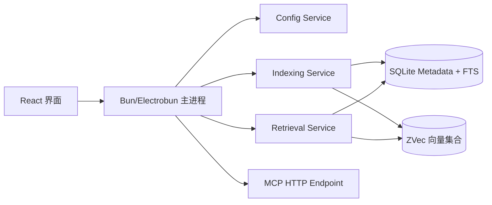
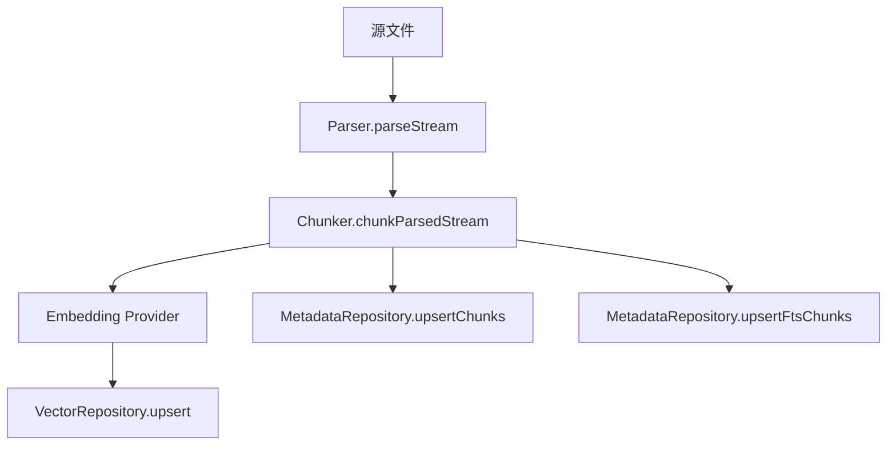
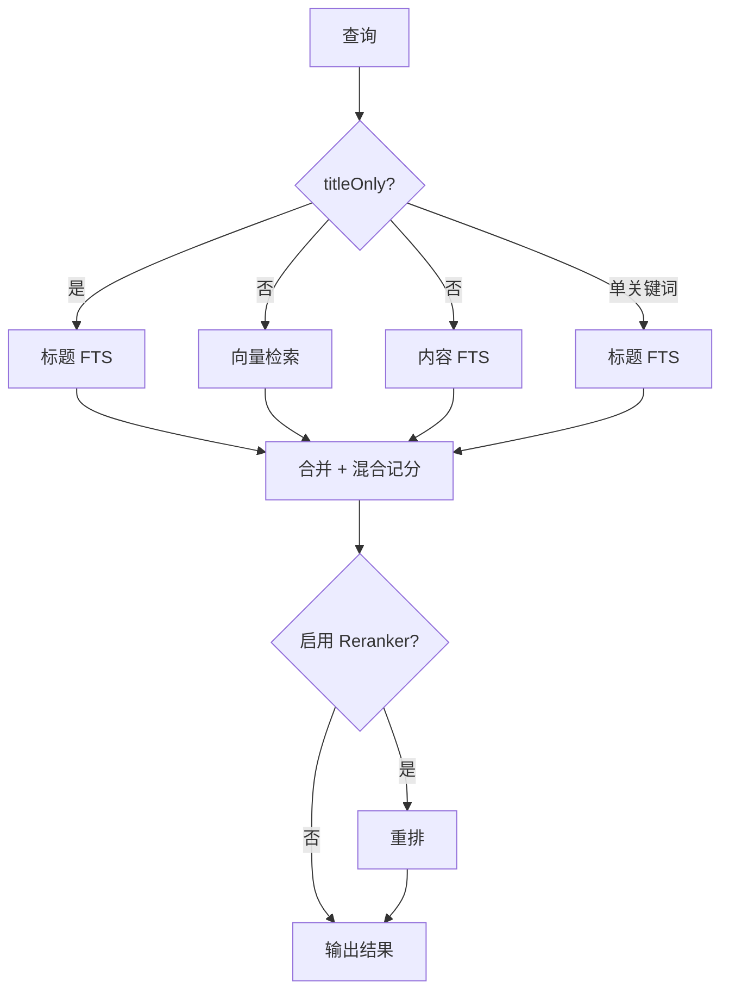

# Know Disk

[English](./README.md) | [中文](./README.zh-CN.md)

Know Disk 是一个本地优先（local-first）的桌面 RAG 系统，核心设计思想非常直接：

**文件系统是真实数据源，索引与向量数据都是可重建的运行时状态。**

它提供了完整的本地知识检索闭环：

1. 选择本地 source 目录
2. 解析并分块文件
3. 做 embedding 并写入索引
4. 通过混合检索（vector + FTS）召回
5. 通过 UI 和 MCP 对外提供能力

## 图示总览



## 1. 设计目标

Know Disk 面向本地知识工作流，重点是“稳定索引、可观测、可恢复”。

核心目标：

- 本地优先：数据与索引都在本机完成
- 缓存可重建：vector/index 状态可以销毁并重新生成
- 可运维：索引与检索过程有明确 health/status/log
- 易扩展：embedding/reranker 使用 provider 化配置，支持 MCP

## 2. 核心概念

### 2.1 三层真相模型

Know Disk 维护三层数据语义：

1. **文件系统（真相）**
   本地文件永远是权威数据源。
2. **SQLite 元数据库（索引状态）**
   记录 files/chunks/jobs/FTS/source tombstones。
3. **向量集合（检索缓存）**
   保存 embedding 及检索所需元数据。

当 metadata 或 vector 不一致时，系统默认可重建，而不是强依赖历史状态。

### 2.2 Source 生命周期

source 来自 `config.sources`。

- 新增/启用 source：触发目录索引写入 metadata + vector
- 禁用/删除 source：进入延迟删除（tombstone）
- 启动清理 + reconcile：处理延迟删除并追平漂移

### 2.3 索引流水线

单文件索引流程：

1. parser 以流式方式读取
2. chunker 按配置分块
3. 对 chunk 做 embedding
4. upsert 到 vector
5. upsert 到 metadata chunks + FTS

metadata 会记录 offset/token estimate，用于后续按文件回溯 chunk 文本。



### 2.4 检索模型

检索是混合模式，并且支持请求级策略：

- 普通模式：
  - vector 搜索
  - 内容 FTS 搜索
  - 若是单关键词，再额外引入标题 FTS
  - 最终做混合记分
- `titleOnly` 模式：
  - 只有标题 FTS 参与记分

若启用 reranker，会在混合召回后做重排。



### 2.5 Onboarding 模型

首次使用流程：

1. 强制至少配置一个 source
2. 可检查 embedding/reranker 默认配置
3. 满足最小可用配置后进入 Home

这样可以避免“配置为空但系统看似可用”的假状态。

### 2.6 虚拟文件系统（VFS）

Know Disk 现已在 `core/vfs` 提供可挂载的 VFS 层，用于多 provider 元数据浏览和 markdown 内容缓存。

- 挂载配置：
  - `syncMetadata=true`：`walkChildren` 从本地 SQLite 元数据（`vfs_nodes`）分页，游标按本地排序边界 `(lastName,lastNodeId)`。
  - `syncMetadata=false`：`walkChildren` 透传 provider 分页游标，同时把结果回填到 `vfs_nodes` 和带 TTL 的 `vfs_page_cache`。
  - `syncContent`：
    - `lazy`：首次 `readMarkdown` 时刷新 markdown。
    - `eager`：预留给主动内容刷新流水线。
- 游标语义：
  - API 统一使用 `VfsCursor = { mode, token }`。
  - `mode=local`：token 编码本地分页边界。
  - `mode=remote`：token 编码 provider 游标。
- 内容缓存：
  - `vfs_markdown_cache` 存完整 markdown 和 hash。
  - `vfs_chunks` 存分块后的 markdown（`seq` 稳定顺序），用于后续检索/索引复用。

## 3. 运行时架构

- **UI（React）**
  负责 settings/onboarding/status/retrieval 交互
- **Bun 主进程（Electrobun）**
  负责 DI 容器、配置持久化、索引编排、MCP 暴露
- **Core Services**
  Config / Indexing / Retrieval / Embedding / Reranker / Vector / Metadata
- **存储层**
  - `bun:sqlite`：metadata + FTS
  - `@zvec/zvec`：向量集合

## 4. 配置策略

配置在启动和更新时都会做 normalize。

关键配置区块：

- `sources`：被监听和索引的目录
- `indexing`：chunking、watch debounce、reconcile、retry
- `embedding`：按 provider 独立配置（local/cloud）
- `reranker`：按 provider 独立配置（local/cloud）
- `mcp`：开关与端口

设计原则：

- config 是运行约束契约
- metadata/vector 是可丢弃可重建的运行缓存

## 5. 健康状态与可观测性

UI 提供健康与索引状态可视化。

状态信息包括：

- run phase/reason/errors
- scheduler queue depth
- worker current files / running workers / last error
- 从 metadata 读取的 indexed files 数

日志使用 pino，按 subsystem 输出结构化日志（如 `indexing`、`vector`、`retrieval`）。

## 6. MCP 集成

启用后会暴露 HTTP MCP endpoint：

- `http://127.0.0.1:<port>/mcp`

外部 MCP 客户端（如 ChatGPT / Claude / Desktop 工具）可直接调用本地检索能力。

## 7. 数据目录

默认运行目录（macOS/Linux）：

- `~/.knowdisk/app-config.json`
- `~/.knowdisk/metadata/index.db`
- `~/.knowdisk/zvec/...`
- `~/.knowdisk/cache/...`

## 8. 典型使用流程

1. 打开应用并完成 onboarding
2. 在 Settings 添加 source 目录
3. 等待 indexing/reconcile 稳定
4. 在 Home 检索（普通模式或 titleOnly）
5. 需要时使用 force resync 做全量重建

## 9. 开发命令

```bash
bun install
bun run dev
```

HMR：

```bash
bun run dev:hmr
```

构建：

```bash
bun run build
```

测试：

```bash
bun test
```

类型检查（不影响运行时构建配置）：

```bash
bunx tsc --noEmit -p tsconfig.typecheck.json
```

## 10. 当前边界与后续方向

当前实现重点在可靠的本地文本 RAG。

自然演进方向：

- 更丰富 parser（pdf/docx/code-aware）
- 更精细的 source 级调度与优先级
- 更可配置的检索记分策略
- 更完整的 MCP tool 能力面

---

一句话理解：**Know Disk = 本地索引引擎 + 混合检索器 + 桌面控制面。**
